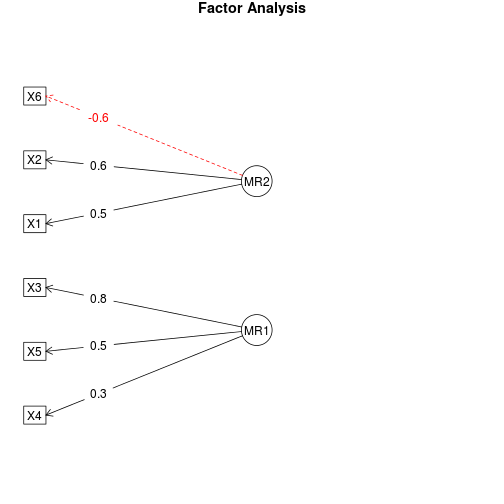
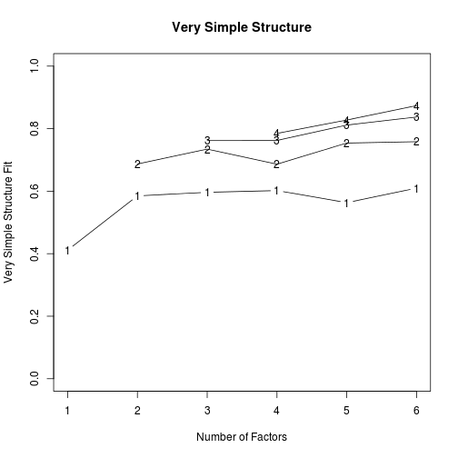

Exploratory factor analysis for ordinal categorical data
=========================

Install required packages
-------------------------

[`GPArotation`](http://cran.r-project.org/package=GPArotation), [`mvtnorm`](http://cran.r-project.org/package=mvtnorm), [`polycor`](http://cran.r-project.org/package=polycor), [`psych`](http://cran.r-project.org/package=psych)


```r
wants <- c("GPArotation", "mvtnorm", "polycor", "psych")
has   <- wants %in% rownames(installed.packages())
if(any(!has)) install.packages(wants[!has])
```

Factor analysis
-------------------------

### Simulate categorical data based on continuous variables

First, let's simulate 200 observations from 6 variables, coming from 2 orthogonal factors. I'll take a couple of intermediate steps and start with multivariate normal continuous data that I later dichotomize. That way, we can compare Pearson correlations with polychoric correlations, and compare factor loadings from continuous data with that from dichotomous data and the true loadings.


```r
set.seed(123)
N <- 200                       # number of observations
P <- 6                         # number of variables
Q <- 2                         # number of factors

# true P x Q loading matrix -> variable-factor correlations
Lambda <- matrix(c(0.7,-0.4, 0.8,0, -0.2,0.9, -0.3,0.4, 0.3,0.7, -0.8,0.1),
                 nrow=P, ncol=Q, byrow=TRUE)
```

Now simulate the actual data from the model $x = \Lambda f + e$, with $x$ being the observed variable values of a person, $\Lambda$ the true loadings matrix, $f$ the latent factor score, and $e$ iid, mean 0, normal errors.


```r
# factor scores (uncorrelated factors)
library(mvtnorm)               # for rmvnorm()
FF <- rmvnorm(N, mean=c(5, 15), sigma=diag(Q))

# matrix with iid, mean 0, normal errors
E   <- rmvnorm(N, rep(0, P), diag(P))
X   <- FF %*% t(Lambda) + E    # matrix with variable values
dfX <- data.frame(X)           # data also as a data frame
```

Now let's categorize the data. We'll keep the data in two formats: as a data frame with ordered factors, and as a numeric matrix. `hetcor()` from package `polycor` gives us the polychoric correlation matrix we'll later use for the FA.


```r
# categorize variables into a list of ordered factors
lOrd <- lapply(dfX, function(x) {
               cut(x, breaks=quantile(x), include.lowest=TRUE,
                   ordered=TRUE, labels=LETTERS[1:4]) })
dfOrd  <- data.frame(lOrd)     # combine list into a data frame
ordNum <- data.matrix(dfOrd)   # categorized data as a numeric matrix
```

### Factor analysis for ordered categorical data

Use the polychoric correlation matrix to do a regular FA.


```r
library(polycor)               # for hetcor()
pc <- hetcor(dfOrd, ML=TRUE)   # polychoric corr matrix
```


```r
library(psych)
faPC <- fa(r=pc$correlations, nfactors=2, n.obs=N, rotate="varimax")
faPC$loadings
```

```

Loadings:
   MR2    MR1   
X1  0.546 -0.196
X2  0.607       
X3 -0.173  0.842
X4 -0.197  0.311
X5  0.336  0.537
X6 -0.619       

                 MR2   MR1
SS loadings    1.231 1.133
Proportion Var 0.205 0.189
Cumulative Var 0.205 0.394
```

It is possible to skip the step of calculating the polychoric correlation matrix, and directly use `fa.poly()` from package `psych`, which does the same thing in the end. This function accepts the raw dichotomous data as a numeric matrix.


```r
# polychoric FA
faPCdirect <- fa.poly(ordNum, nfactors=2, rotate="varimax")
```


```r
faPCdirect$fa$loadings         # loadings are the same as above ...
```

```

Loadings:
   MR2    MR1   
X1  0.546 -0.196
X2  0.605       
X3 -0.174  0.841
X4 -0.198  0.311
X5  0.336  0.538
X6 -0.621       

                 MR2   MR1
SS loadings    1.231 1.133
Proportion Var 0.205 0.189
Cumulative Var 0.205 0.394
```

Factor scores
-------------------------

For factor scores, look at package `ltm` which has a `factor.scores()` function specifically for polytomous outcome data. An example is provided on [this page](http://eur.academia.edu/DimitrisRizopoulos/Teaching) -> "Factor Scores - Ability Estimates".

Visualize loadings
-------------------------

You can visualize the loadings from the factor analysis using `factor.plot()` and `fa.diagram()`, both from package `psych`. For some reason, `factor.plot()` accepts only the `$fa` component of the result from `fa.poly()`, not the full object.


```r
factor.plot(faPCdirect$fa, cut=0.5)
```

 

```r
fa.diagram(faPCdirect)
```

 

Determine number of factors
-------------------------

Parallel analysis and a "very simple structure" analysis provide help in selecting the number of factors. Again, package `psych` has the required functions. `vss()` takes the polychoric correlation matrix as an argument.


```r
fap <- fa.parallel.poly(ordNum)   # parallel analysis for dichotomous data
```

 


```r
fap
```

```
Call: fa.parallel.poly(x = ordNum)
Parallel analysis suggests that the number of factors =  1  and the number of components =  1 

 Eigen Values of 
  Original factors Simulated data Original components simulated data   NA
1             1.23              1                  10           0.79 0.28
    NA   NA   NA   NA   NA   NA    NA   NA   NA   NA NA NA   NA   NA   NA
1 0.94 0.81 0.15 0.38 1.05 0.67 -0.37 -1.9 0.09 1.92  1 10 1.27 0.08 1.25
    NA   NA   NA   NA   NA   NA    NA   NA
1 1.26 0.08 1.18 1.39 0.21 0.38 -1.66 0.03
```

```r
vss(pc$correlations, n.obs=N, rotate="varimax")  # very simple structure
```

 

```

Very Simple Structure
Call: vss(x = pc$correlations, rotate = "varimax", n.obs = N)
VSS complexity 1 achieves a maximimum of 0.61  with  6  factors
VSS complexity 2 achieves a maximimum of 0.76  with  6  factors

The Velicer MAP achieves a minimum of NA  with  1  factors 
BIC achieves a minimum of  NA  with  2  factors
Sample Size adjusted BIC achieves a minimum of  NA  with  2  factors

Statistics by number of factors 
  vss1 vss2   map dof   chisq    prob sqresid  fit RMSEA BIC SABIC complex
1 0.41 0.00 0.076   9 7.8e+01 4.9e-13    4.56 0.41 0.198  30 58.38     1.0
2 0.58 0.69 0.107   4 7.9e+00 9.4e-02    2.43 0.69 0.072 -13 -0.59     1.3
3 0.60 0.73 0.223   0 4.4e-01      NA    1.85 0.76    NA  NA    NA     1.4
4 0.60 0.69 0.400  -3 0.0e+00      NA    1.67 0.78    NA  NA    NA     1.6
5 0.56 0.75 1.000  -5 1.7e-13      NA    1.31 0.83    NA  NA    NA     1.5
6 0.61 0.76    NA  -6 0.0e+00      NA    0.85 0.89    NA  NA    NA     1.4
   eChisq    SRMR eCRMS eBIC
1 1.3e+02 1.5e-01 0.188   80
2 7.1e+00 3.4e-02 0.066  -14
3 3.6e-01 7.7e-03    NA   NA
4 8.2e-15 1.2e-09    NA   NA
5 1.5e-13 5.1e-09    NA   NA
6 3.3e-26 2.4e-15    NA   NA
```

Detach (automatically) loaded packages (if possible)
-------------------------


```r
try(detach(package:GPArotation))
try(detach(package:psych))
try(detach(package:polycor))
try(detach(package:sfsmisc))
try(detach(package:mvtnorm))
```

(based on an answer I wrote on CrossValidated)

Get the article source from GitHub
----------------------------------------------

[R markdown](https://github.com/dwoll/RExRepos/raw/master/Rmd/multFApoly.Rmd) - [markdown](https://github.com/dwoll/RExRepos/raw/master/md/multFApoly.md) - [R code](https://github.com/dwoll/RExRepos/raw/master/R/multFApoly.R) - [all posts](https://github.com/dwoll/RExRepos/)
